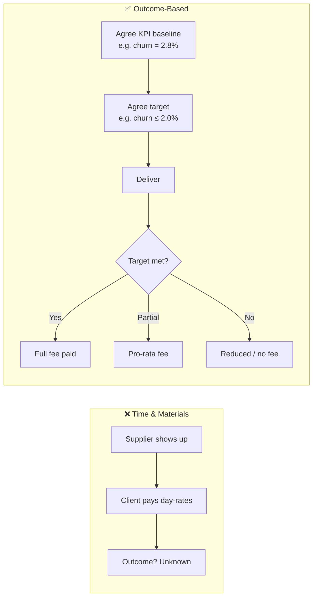
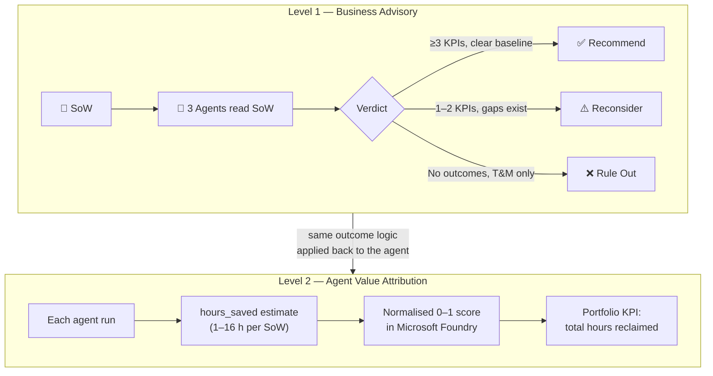
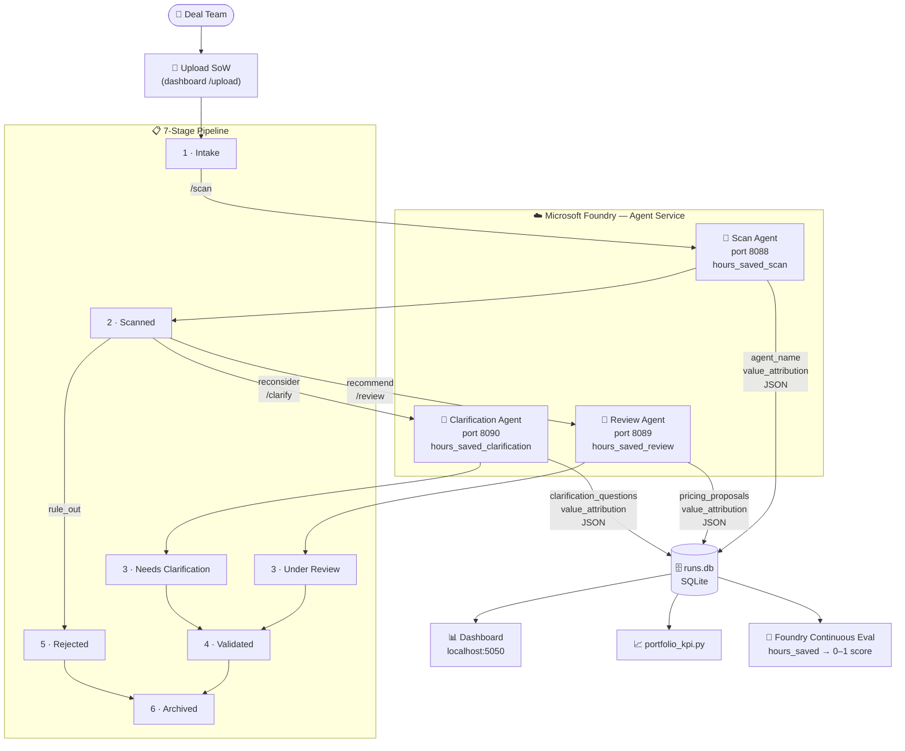

# Outcome Readiness Review — Multi-Agent Pipeline

> A pipeline of three AI agents that demonstrates outcome-based commercial logic at **two levels**: the agents assess client SoWs for outcome-based pricing feasibility (Level 1), and are themselves scored on the outcomes they deliver (Level 2).

Built on **Microsoft Agent Framework** and **Microsoft Foundry**.

**Author:** [Douwe van de Ruit](https://www.linkedin.com/in/dvanderuit/) — Principal AI Solutions Architect

---

## The problem

Traditional consulting contracts pay for **effort**: the client pays day-rates regardless of whether the project delivered a measurable business result. **Outcome-based pricing** is better — the supplier's fee is tied to a real result, creating shared accountability and stronger delivery incentives.

But outcome-based pricing only works when three conditions hold in the Statement of Work:

| Condition | What it means | What breaks it |
|---|---|---|
| **Defined outcomes** | The SoW describes a measurable business result | Vague deliverables like "system go-live" or "data migration complete" |
| **Measurable KPIs** | Each outcome has a baseline, a target, and an agreed measurement method | No baseline data, no agreed data source, KPIs defined too late |
| **No structural blockers** | The engagement allows outcome-linked payments | Regulatory constraints, pure T&M scope, client-side data access issues |



Checking these conditions manually requires reading every SoW carefully and applying commercial judgement. A trained analyst takes **4–8 hours per engagement**. Across a portfolio of hundreds of opportunities per year, this is a serious bottleneck — and a risk that assessments are skipped or done inconsistently.

---

## The solution — outcome-based logic at two levels

This project demonstrates outcome-based commercial thinking at **two levels simultaneously**. These are not separate features — they are the same principle applied twice, which is the point.

### Level 1 — SoW feasibility review

A pipeline of **three specialised agents** reads each Statement of Work and assesses whether it can support an outcome-based commercial model. Each agent handles a different stage of the review:

| Agent | Pipeline stage | What it does |
|---|---|---|
| 🤖 **Scan Agent** | Scanned | First-pass verdict — extracts outcomes, scores KPI completeness, flags T&M risks |
| 🤖 **Review Agent** | Under Review | Commercial deep-dive — designs outcome-based pricing structures, quantifies risk |
| 🤖 **Clarification Agent** | Needs Clarification | Re-scope facilitation — drafts targeted clarification questions and rescope checklist |

The Scan Agent produces one of three verdicts:

| Verdict | Meaning |
|---|---|
| ✅ `recommend` | Clear, measurable outcomes — proceed to outcome-based pricing |
| ⚠️ `reconsider` | Potential exists but KPI gaps need resolving first — routed to Clarification Agent |
| ❌ `rule_out` | No measurable outcomes or structural blockers — use T&M or fixed-fee |

### Level 2 — Agent Value Attribution

The agents do not just produce verdicts — they are themselves held to outcome-based standards. This is formalised as **Agent Value Attribution**: a structured approach to measuring, recording, and surfacing the value delivered by AI agents so it can be audited, compared, and reported.

Four concepts make up the framework:

| Concept | Definition |
|---|---|
| **Agent Value Attribution** | The discipline of linking AI agent activity to a measurable business outcome — in this case, analyst hours reclaimed per engagement reviewed |
| **Agent Value Ledger** | The operational system of record for all value entries. In this project, `runs.db` is the ledger: every agent run that produces a verdict writes an `hours_saved` entry to the ledger |
| **Attributed Value** | The per-run output of the attribution calculation — `hours_saved` in hours (1.0–8.0). Each entry is stamped with `agent_name`, `run_id`, `opportunity_id`, and timestamp |
| **Value Realization** | The portfolio-level accumulation of Attributed Value entries over time — the number leadership cares about: total analyst hours reclaimed, coverage rate, and outcome-ready engagement count |

Each agent reports the analyst hours its automation replaced (`hours_saved`), which is scored as a 0–1 metric in Microsoft Foundry's continuous evaluation pipeline. The agents earn credit only for value produced, not for effort expended.

This applies outcome-based logic at **two levels simultaneously**:



The symmetry is intentional: the same rigour applied to client SoWs is applied back to the AI system itself.

---

## How it works

The three agents run as independent HTTP servers registered in Microsoft Foundry Agent Service. A SoW enters the pipeline via the dashboard and flows through up to seven stages:



---

## Portfolio Dashboard


The dashboard (`python dashboard.py` → http://localhost:5050) shows the full 7-stage pipeline as a Kanban board: Level 1 verdicts on each card, **Attributed Value** (`hours_saved`) per engagement, and a portfolio-level **Agent Value Ledger** summary across all three agents. The KPI tiles show Value Realization at a glance — total hours reclaimed, coverage rate, and engagement count cleared for outcome-based pricing.

---

## Quick Start

**Prerequisites:** Python 3.11+, Azure CLI (`az login` done), an Azure subscription.

### Step 1 — Deploy infrastructure

```bash
# Create the resource group (Sweden Central)
az group create --name rg-outcome-readiness-agent --location swedencentral

# Deploy Foundry account, project, and gpt-4o model deployment
az deployment group create \
  --resource-group rg-outcome-readiness-agent \
  --template-file infra/main.bicep
```

The deployment outputs three values you will need for `.env`:

| Output | Used as |
|---|---|
| `projectEndpoint` | `FOUNDRY_PROJECT_ENDPOINT` |
| `modelDeploymentName` | `FOUNDRY_MODEL_DEPLOYMENT_NAME` |

To retrieve them after deployment:

```bash
az deployment group show \
  --resource-group rg-outcome-readiness-agent \
  --name main \
  --query properties.outputs
```

### Step 2 — Configure environment

```bash
# Copy the template and fill in the values printed by the deployment above
cp .env.template .env
```

Retrieve the Application Insights connection string (required for continuous evaluation):

```bash
python3 -c "
from azure.ai.projects import AIProjectClient
from azure.identity import DefaultAzureCredential
import os; from dotenv import load_dotenv; load_dotenv()
client = AIProjectClient(os.environ['FOUNDRY_PROJECT_ENDPOINT'], DefaultAzureCredential())
print(client.telemetry.get_application_insights_connection_string())
"
```

Paste the output into `.env` as `APPLICATIONINSIGHTS_CONNECTION_STRING`.

### Step 3 — Install and one-time setup

```bash
pip install -r requirements.txt

python setup_eval.py       # creates runs.db + registers Foundry evaluator + eval rule
python register_agent.py   # registers all 3 agents in Foundry
```

### Step 4 — Start the agent servers

Open three terminals (or use `&` to background them):

```bash
python agents/scan_agent.py          # port 8088
python agents/review_agent.py        # port 8089
python agents/clarification_agent.py # port 8090
```

### Step 5 — Run the demo

```bash
python run_demo.py             # submits all sample SoWs through Scan Agent
python run_demo.py --index 0   # submits one SoW (0-based)
```

### Step 6 — View results

```bash
python portfolio_kpi.py        # CLI report
python dashboard.py            # browser dashboard → http://localhost:5050
```

---

## Repository Structure

| File | Purpose |
|---|---|
| `agents/scan_agent.py` | Scan Agent — first-pass verdict, port 8088 |
| `agents/review_agent.py` | Review Agent — commercial deep-dive, port 8089 |
| `agents/clarification_agent.py` | Clarification Agent — re-scope facilitation, port 8090 |
| `agent.py` | Legacy single-agent entry point (superseded by `agents/`) |
| `register_agent.py` | One-time Foundry registration for all 3 agents |
| `setup_eval.py` | One-time: `runs.db`, Foundry evaluator, ContinuousEvaluationRule |
| `run_demo.py` | Submits SoWs to the Scan Agent, logs results to `runs.db` |
| `portfolio_kpi.py` | CLI KPI report |
| `dashboard.py` | Browser KPI dashboard (port 5050) |
| `sample_sows.json` | 12 synthetic SoWs covering all verdicts |
| `infra/main.bicep` | Bicep: Foundry account, project, gpt-4o deployment |
| `docs/` | Architecture, value attribution, contributing, and build-your-own guides |
| `media/` | Dashboard screenshots |

---

## Further Reading

| Doc | Contents |
|---|---|
| [docs/outcome-based-models.md](docs/outcome-based-models.md) | What outcome-based commercial models are and why they're hard to scale |
| [docs/value-attribution.md](docs/value-attribution.md) | How the agent measures and proves its own value (Level 2) |
| [docs/architecture.md](docs/architecture.md) | System architecture, process flow diagrams, agent decision logic |
| [docs/build-your-own.md](docs/build-your-own.md) | Step-by-step guide to adapting this pattern to your own domain |
| [docs/CONTRIBUTING.md](docs/CONTRIBUTING.md) | Contribution guidelines |
| [docs/SECURITY.md](docs/SECURITY.md) | Security policy and vulnerability reporting |
