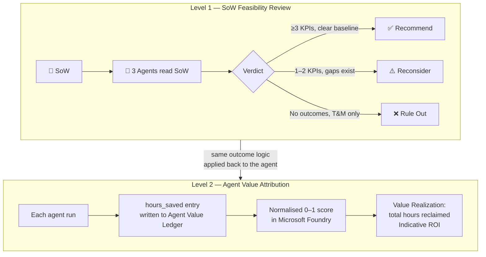
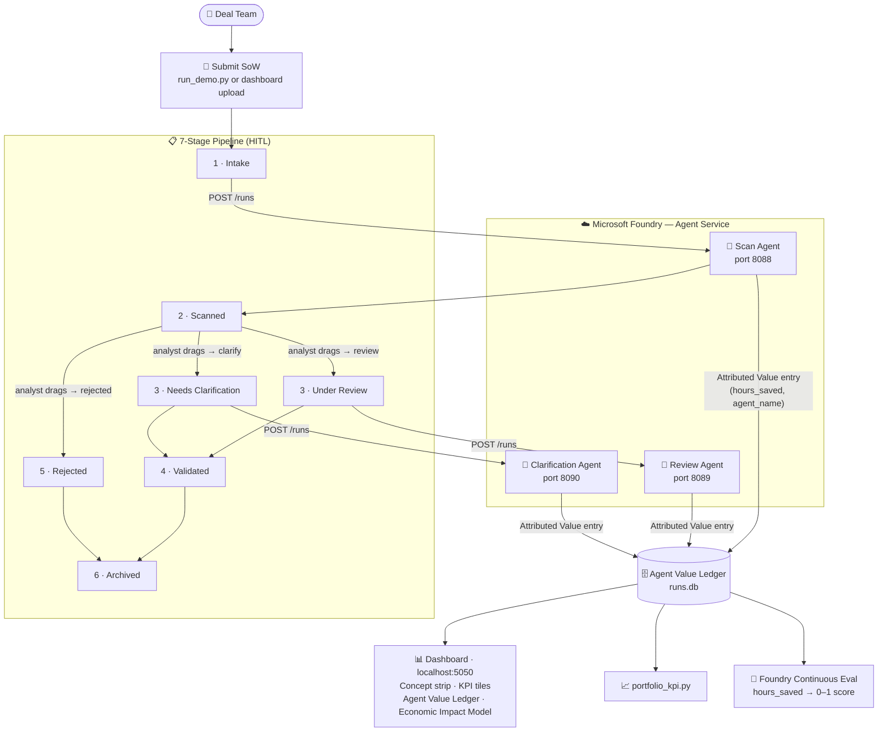

# Outcome Readiness Review — Agent Value Attribution Demo

> A thought-leadership demo showing how to build **outcome-based agentic solutions**: AI agents that not only do work, but make the value they create visible, record it in a governed way, and relate it to investment and operating cost.

Built on **Microsoft Agent Framework** and **Microsoft Foundry**.

**Author:** [Douwe van de Ruit](https://www.linkedin.com/in/dvanderuit/) — Principal AI Solutions Architect

---

## Why this demo exists

Most AI agent demos show that agents *can* do things. This demo shows something harder to build and more important to enterprise buyers: an agentic system that **measures, records, and makes visible the business value it creates** — and relates that value to the cost of building and running it.

The question enterprise decision-makers actually ask is not "can AI do this task?" It is:

> *"If we invest in building and operating this agent, will the value it creates justify that investment — and how will we know?"*

This demo answers that question. It does so using a concrete use case — reviewing Statements of Work for outcome-based pricing feasibility — but the framework it demonstrates applies to any outcome-oriented agentic solution.

---

## The use case: outcome-based pricing at scale

Traditional consulting contracts pay for **effort**: the client pays day-rates regardless of whether the project delivered a measurable result. **Outcome-based pricing** is better — fees tied to real results, shared accountability, stronger delivery incentives.

But outcome-based pricing only works when the Statement of Work contains three things:

| Condition | What it means | What breaks it |
|---|---|---|
| **Defined outcomes** | A measurable business result, not a deliverable | Vague scope like "system go-live" |
| **Measurable KPIs** | Baseline, target, and agreed measurement method | No baseline data, no agreed data source |
| **No structural blockers** | The engagement allows outcome-linked payments | Regulatory constraints, pure T&M scope |

Checking these conditions manually requires 4–8 hours per SoW. Across hundreds of opportunities per year, this is a bottleneck — and a risk that assessments are skipped or done inconsistently.

Three AI agents replace this manual review, at a fraction of the time and cost.

---

## The four core concepts

This demo is built on four named, first-class concepts. They are not background terminology — they are the conceptual skeleton of the product, visible throughout the UI and enforced at every layer of the architecture.

---

### 🔵 Agent Value Attribution — *Framework*

> The discipline of linking AI agent activity to a measurable business outcome.

Not just "the agent ran" — but "the agent created X hours of analyst value, which translates to €Y at an assumed rate." Agent Value Attribution is the governing framework: it defines *what counts as value*, *how it is measured*, and *who is accountable for it*.

This is the overarching concept. The three concepts below are its operational components.

---

### 🟢 Agent Value Ledger — *System of Record*

> The governed register where every agent run writes a timestamped value entry.

Every time an agent produces a verdict, it writes a structured entry to the ledger:

| Field | Description |
|---|---|
| `run_id` | UUID identifying this agent run |
| `opportunity_id` | The SoW being assessed |
| `agent_name` | Which agent produced the entry |
| `hours_saved` | Attributed value for this run (1.0–8.0 h) |
| `recommendation` | `recommend` / `reconsider` / `rule_out` |
| `status` | `draft` → `validated` → `approved` |

In this project, `runs.db` is the ledger. In production, this would be a governed datastore with audit trail, access control, and retention policy.

---

### 🟣 Indicative ROI — *Dashboard Metric*

> The executive-facing financial signal: ledger value translated into return on investment.

Indicative ROI is the portfolio-level number that answers the question leadership actually asks: *"Is this agent worth the investment?"* It is derived from the Agent Value Ledger via the Economic Impact Model below, and displayed prominently in the dashboard.

It is explicitly *indicative* — assumption-driven and scenario-based — not a contractual guarantee. Its purpose is to support internal business case conversations with credible, transparent figures.

---

### 🟡 Economic Impact Model — *Calculation Logic*

> The transparent, assumption-driven model that converts attributed hours into financial terms.

The model takes five adjustable inputs and computes six output metrics:

| Input assumption | Default (Expected scenario) | What it drives |
|---|---|---|
| Analyst hourly rate | €110/h | Monetary value of attributed hours |
| One-time build cost | €60k | Initial investment to recover |
| Monthly operating cost | €3k | Ongoing run cost |
| Utilisation / adoption | 70% | Effective value capture rate |
| Annual SoW throughput | 800 h/yr | Scale of attributed value at full deployment |

Three scenario presets (Conservative / Expected / Upside) let stakeholders explore the range:

| Scenario | Build cost | Opex/mo | Rate | Util | Throughput | Est. payback |
|---|---|---|---|---|---|---|
| Conservative | €80k | €4k | €90/h | 55% | 500 h/yr | ~5 months |
| Expected | €60k | €3k | €110/h | 70% | 800 h/yr | ~2 months |
| Upside | €40k | €2k | €135/h | 85% | 1,200 h/yr | ~1 month |

Output metrics: **Gross Attributed Value**, **Build Cost**, **Annual Operating Cost**, **Net Value (12 months)**, **Indicative ROI**, **Estimated Payback Period**.

All assumptions are visible and adjustable in the dashboard — there is no hidden calculation.

---

### How the four concepts connect

```
Agent run
  → hours_saved entry written to Agent Value Ledger
    → Economic Impact Model converts hours to €
      → Indicative ROI surfaced in dashboard
        ← all governed by Agent Value Attribution framework
```

The dashboard makes this chain visible at every level: per-run, per-engagement, and across the full portfolio.

---

## The solution: outcome-based logic at two levels

This project demonstrates outcome-based commercial thinking at **two levels simultaneously**.

### Level 1 — SoW feasibility review

A pipeline of **three specialised agents** reads each Statement of Work and assesses whether it can support an outcome-based commercial model:

| Agent | Pipeline stage | What it does |
|---|---|---|
| 🤖 **Scan Agent** | Scanned | First-pass verdict — extracts outcomes, scores KPI completeness, flags T&M risks |
| 🤖 **Review Agent** | Under Review | Commercial deep-dive — designs outcome-based pricing structures, quantifies risk |
| 🤖 **Clarification Agent** | Needs Clarification | Re-scope facilitation — drafts targeted clarification questions and rescope checklist |

Verdicts:

| Verdict | Meaning |
|---|---|
| ✅ `recommend` | Clear, measurable outcomes — proceed to outcome-based pricing |
| ⚠️ `reconsider` | Potential exists but KPI gaps must be resolved — routed to Clarification Agent |
| ❌ `rule_out` | No measurable outcomes or structural blockers — use T&M or fixed-fee |

### Level 2 — Agent Value Attribution

The agents do not just produce verdicts — they are themselves held to outcome-based standards. Each agent reports the analyst hours its automation replaced (`hours_saved`), scored as a 0–1 metric in Microsoft Foundry's continuous evaluation pipeline. The agents earn credit only for value produced, not for effort expended.

This symmetry is the point: the same rigour applied to client SoWs is applied back to the AI system itself.



---

## How it works



---

## Portfolio Dashboard


The dashboard (`python dashboard.py` → http://localhost:5050) is structured around value attribution, not the pipeline board. Page layout from top to bottom:

1. **Four core concepts strip** — Agent Value Attribution · Agent Value Ledger · Indicative ROI · Economic Impact Model, visible as labelled cards immediately below the topbar
2. **KPI tiles** — Engagements in scope, Validated coverage, Attributed Value (hours), Value Realization candidates
3. **Economic Impact Model** — expandable panel with three scenario presets (Conservative / Expected / Upside) and five adjustable assumptions; shows Indicative ROI and estimated payback period
4. **Agent Value Ledger** — the hero section: a full register of all attributed value entries, one row per unique engagement, with verdict, attributed hours, ledger status, and click-through to the detail panel
5. **Pipeline board** — 7-stage Kanban view (Intake → Archived) with drag-and-drop and human-in-the-loop confirmation for agent-triggered stage transitions
6. **Per-engagement detail panel** — Agent Assessment, Detected Outcomes, KPI Gaps, Commercial Direction, and the full Agent Value Ledger entry for that engagement

---

## Quick Start

**Prerequisites:** Python 3.11+, Azure CLI (`az login` done), an Azure subscription.

### Step 1 — Deploy infrastructure

```bash
az group create --name rg-outcome-readiness-agent --location swedencentral

az deployment group create \
  --resource-group rg-outcome-readiness-agent \
  --template-file infra/main.bicep
```

The deployment outputs `projectEndpoint` and `modelDeploymentName` — you need both for `.env`.

```bash
az deployment group show \
  --resource-group rg-outcome-readiness-agent \
  --name main \
  --query properties.outputs
```

### Step 2 — Configure environment

```bash
cp .env.template .env
```

Retrieve the Application Insights connection string (required for continuous evaluation):

```bash
python3 -c "
from azure.ai.projects import AIProjectClient
from azure.identity import DefaultAzureCredential
import os; from dotenv import load_dotenv; load_dotenv()
client = AIProjectClient(os.environ['FOUNDRY_PROJECT_ENDPOINT'], DefaultAzureCredential())
print(client.telemetry.get_application_insights_connection_string())
"
```

Paste the output into `.env` as `APPLICATIONINSIGHTS_CONNECTION_STRING`.

### Step 3 — Install and one-time setup

```bash
pip install -r requirements.txt

python setup_eval.py       # creates runs.db (the Agent Value Ledger) + registers Foundry evaluator
python register_agent.py   # registers all 3 agents in Foundry
```

### Step 4 — Start the agent servers

Open three terminals (or use `&` to background them):

```bash
python agents/scan_agent.py          # port 8088
python agents/review_agent.py        # port 8089
python agents/clarification_agent.py # port 8090
```

### Step 5 — Run the demo

```bash
python run_demo.py             # submits all sample SoWs through Scan Agent
python run_demo.py --index 0   # submits one SoW (0-based)
```

### Step 6 — View results

```bash
python portfolio_kpi.py        # CLI Value Realization report
python dashboard.py            # browser dashboard → http://localhost:5050
```

---

## Repository Structure

| File | Purpose |
|---|---|
| `agents/scan_agent.py` | Scan Agent — first-pass verdict, port 8088 |
| `agents/review_agent.py` | Review Agent — commercial deep-dive, port 8089 |
| `agents/clarification_agent.py` | Clarification Agent — re-scope facilitation, port 8090 |
| `agent.py` | Legacy single-agent entry point (superseded by `agents/`) |
| `register_agent.py` | One-time Foundry registration for all 3 agents |
| `setup_eval.py` | One-time: `runs.db` (Agent Value Ledger), Foundry evaluator, ContinuousEvaluationRule |
| `run_demo.py` | Submits SoWs to the Scan Agent, logs Attributed Value entries to `runs.db` |
| `portfolio_kpi.py` | CLI Value Realization report |
| `dashboard.py` | Browser dashboard — concept strip, KPI row, Economic Impact Model, Agent Value Ledger table, pipeline board, detail panel (port 5050) |
| `sample_sows.json` | 26 synthetic SoWs covering all verdicts |
| `infra/main.bicep` | Bicep: Foundry account, project, gpt-4o deployment |
| `docs/` | Architecture, value attribution, contributing, and build-your-own guides |

---

## Further Reading

| Doc | Contents |
|---|---|
| [docs/outcome-based-models.md](docs/outcome-based-models.md) | What outcome-based commercial models are and why they're hard to scale |
| [docs/value-attribution.md](docs/value-attribution.md) | Agent Value Attribution in depth — Ledger, Attributed Value, Value Realization |
| [docs/architecture.md](docs/architecture.md) | System architecture, process flow, agent decision logic |
| [docs/build-your-own.md](docs/build-your-own.md) | Step-by-step guide to adapting this pattern to your own domain |
| [docs/CONTRIBUTING.md](docs/CONTRIBUTING.md) | Contribution guidelines |
| [docs/SECURITY.md](docs/SECURITY.md) | Security policy and vulnerability reporting |
