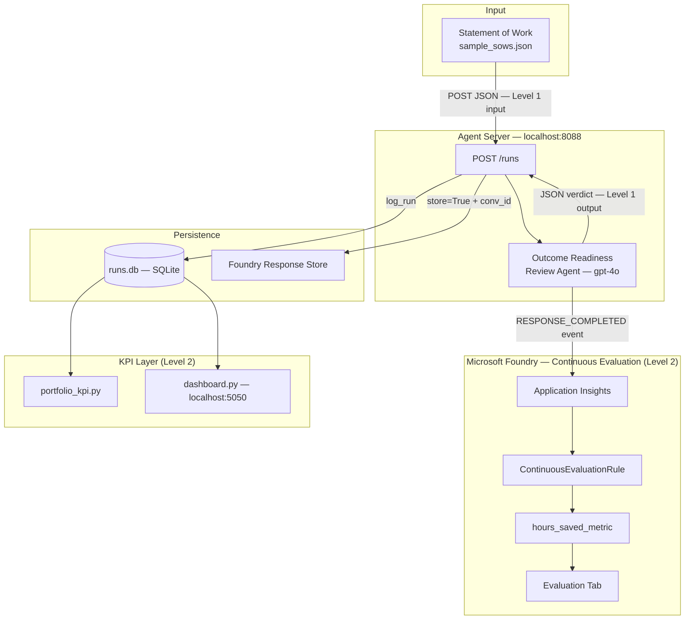
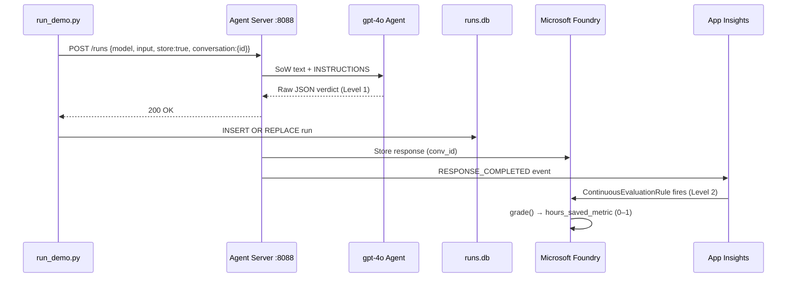
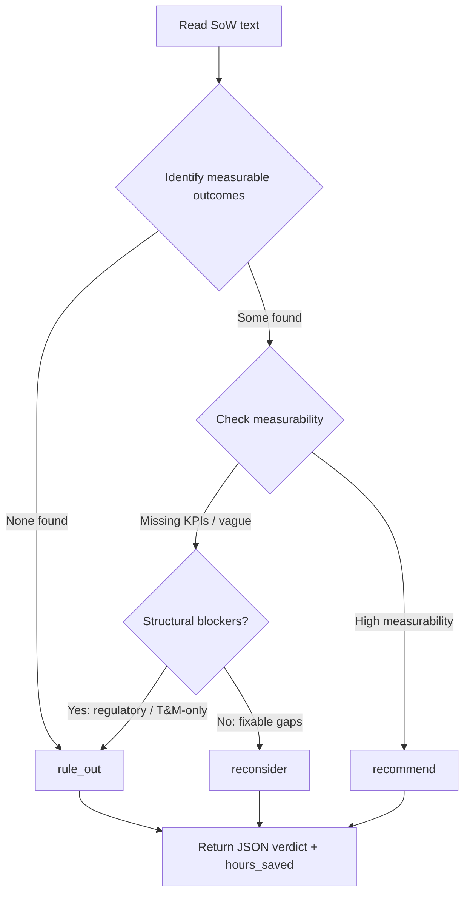

# Architecture

## System Overview



---

## Per-SoW Process Flow



---

## Agent Decision Logic (Level 1)



---

## Key Components

| Component | File | Role |
|---|---|---|
| Agent definition | `agent.py` | `INSTRUCTIONS` prompt + `AzureAIClient.as_agent()` |
| HTTP server | `agent.py` | `from_agent_framework(agent).run_async()` on port 8088 |
| Demo runner | `run_demo.py` | Builds payload, POSTs to `/runs`, parses response, logs to `runs.db` |
| Eval setup | `setup_eval.py` | Registers `hours_saved_metric` evaluator + `ContinuousEvaluationRule` |
| Persistence | `runs.db` | SQLite — `run_id`, `opportunity_id`, `engagement_name`, `recommendation`, `status`, `hours_saved`, `created_at`, `foundry_conv_id` |
| KPI CLI | `portfolio_kpi.py` | Reads `runs.db`, prints per-engagement breakdown + coverage rate |
| KPI dashboard | `dashboard.py` | Self-contained HTTP server, renders live HTML from `runs.db` |
| Infra | `infra/main.bicep` | AIServices account, Foundry project, gpt-4o deployment |

---

## API Contract

The agent server accepts the OpenAI Responses API shape on `POST /runs`:

```json
{
  "model": "gpt-4o",
  "input": "<full SoW text>",
  "store": true,
  "conversation": { "id": "conv_<foundry-id>" }
}
```

Response shape parsed by `run_demo.py`:
```
wrapper["output"][0]["content"][0]["text"]  →  JSON string  →  dict
```

The agent always returns a **single raw JSON object** — no markdown fences, no prose.
