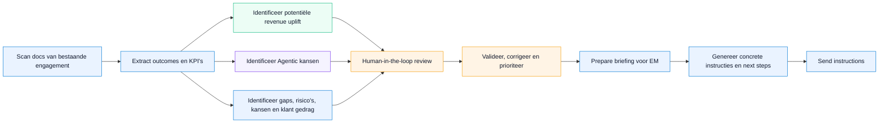

# Concept Flow — Outcome Readiness Review

## Stappen

| Stap | Beschrijving |
|---|---|
| **Scan docs** | Bestaande engagement-documenten (SoW, RFP, MSA, etc.) worden ingelezen. |
| **Extract outcomes en KPI's** | Meetbare business outcomes en KPI's worden automatisch geïdentificeerd. |
| **Potentiële revenue uplift** 🟢 | De financiële waarde van omzetting naar outcome-based pricing wordt geschat. |
| **Agentic kansen** 🟣 | Taken en beslismomenten die door een AI-agent overgenomen kunnen worden, worden in kaart gebracht. |
| **Gaps, risico's en kansen** 🔵 | Ontbrekende KPI's, onduidelijke scope, commerciële risico's én klant gedrag (organisatorische volwassenheid, besluitvaardigheid en risicobereidheid) worden zichtbaar gemaakt. |
| **Human-in-the-loop review** | Een reviewer controleert en verrijkt de geëxtraheerde inzichten. |
| **Valideer, corrigeer en prioriteer** | De reviewer stelt de prioritering bij en keurt de bevindingen goed. |
| **Prepare briefing voor EM** | De uitkomst wordt samengevat in een briefing voor de Engagement Manager. |
| **Genereer instructies** | Concrete acties en next steps worden voorbereid. |
| **Send instructions** | Briefing en instructies worden doorgestuurd naar de betrokken partijen. |
